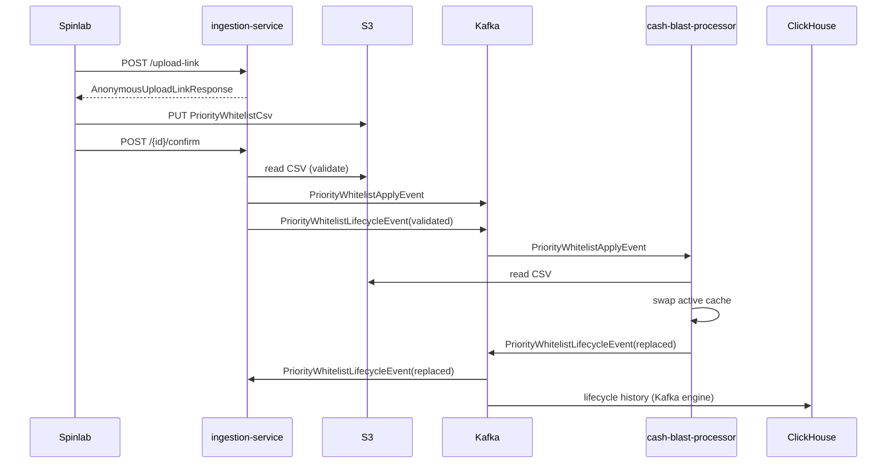

# priority-whitelist-e2e

End-to-end priority whitelist exchange. Spinlab uploads a CSV; cash-blast-processor swaps the active whitelist on the next draw; lifecycle is mirrored across services.

## Flow

<pre>
1. Spinlab → ingestion-service · <a href="../../xplatform-priority-whitelist-ingestion-service/ingestion-service/flows/upload-link.md">upload-link issuance</a>:
   POST /api/v1/whitelist/upload-link
   ← <a href="../../xplatform-priority-whitelist-ingestion-service/ingestion-service/objects/AnonymousUploadLinkResponse.md">AnonymousUploadLinkResponse</a> (<a href="../../xplatform-priority-whitelist-ingestion-service/ingestion-service/">ingestion-service</a> <a href="../../xplatform-priority-whitelist-ingestion-service/ingestion-service/contracts/rest.md">HTTP</a>)

2. Spinlab → S3:
   PUT <a href="../../xplatform-priority-whitelist-ingestion-service/ingestion-service/objects/PriorityWhitelistCsv.md">PriorityWhitelistCsv</a> (<a href="../../xplatform-priority-whitelist-ingestion-service/ingestion-service/">ingestion-service</a> <a href="../../xplatform-priority-whitelist-ingestion-service/ingestion-service/contracts/s3.md">S3</a>) body to presigned URL

3. Spinlab → ingestion-service · <a href="../../xplatform-priority-whitelist-ingestion-service/ingestion-service/flows/upload-confirm.md">upload-confirm</a>:
   POST /api/v1/whitelist/{id}/confirm

4. ingestion-service · <a href="../../xplatform-priority-whitelist-ingestion-service/ingestion-service/flows/upload-validate-emit.md">upload-validate-emit</a>:
   validate CSV at s3_key
   on success: emit <a href="../../xplatform-priority-whitelist-ingestion-service/ingestion-service/objects/PriorityWhitelistApplyEvent.md">PriorityWhitelistApplyEvent</a> (<a href="../../xplatform-priority-whitelist-ingestion-service/ingestion-service/">ingestion-service</a> <a href="../../xplatform-priority-whitelist-ingestion-service/ingestion-service/contracts/kafka.md">Kafka</a>)
   always:     emit <a href="../../xplatform-priority-whitelist-ingestion-service/ingestion-service/objects/PriorityWhitelistLifecycleEvent.md">PriorityWhitelistLifecycleEvent</a> (<a href="../../xplatform-priority-whitelist-ingestion-service/ingestion-service/">ingestion-service</a> <a href="../../xplatform-priority-whitelist-ingestion-service/ingestion-service/contracts/kafka.md">Kafka</a>)(status=validated | invalid | expired)

5. cash-blast-processor · <a href="../../cash-blast-processor-service/cash-blast-processor/flows/draw-time-application.md">draw-time-application</a>:
   consume <a href="../../xplatform-priority-whitelist-ingestion-service/ingestion-service/objects/PriorityWhitelistApplyEvent.md">PriorityWhitelistApplyEvent</a> (<a href="../../xplatform-priority-whitelist-ingestion-service/ingestion-service/">ingestion-service</a> <a href="../../xplatform-priority-whitelist-ingestion-service/ingestion-service/contracts/kafka.md">Kafka</a>)
   read <a href="../../xplatform-priority-whitelist-ingestion-service/ingestion-service/objects/PriorityWhitelistCsv.md">PriorityWhitelistCsv</a> (<a href="../../xplatform-priority-whitelist-ingestion-service/ingestion-service/">ingestion-service</a> <a href="../../xplatform-priority-whitelist-ingestion-service/ingestion-service/contracts/s3.md">S3</a>) at event.s3_key
   swap active whitelist cache
   emit <a href="../../xplatform-priority-whitelist-ingestion-service/ingestion-service/objects/PriorityWhitelistLifecycleEvent.md">PriorityWhitelistLifecycleEvent</a> (<a href="../../xplatform-priority-whitelist-ingestion-service/ingestion-service/">ingestion-service</a> <a href="../../xplatform-priority-whitelist-ingestion-service/ingestion-service/contracts/kafka.md">Kafka</a>)(status=replaced)

6. ingestion-service · <a href="../../xplatform-priority-whitelist-ingestion-service/ingestion-service/flows/lifecycle-replaced.md">lifecycle-replaced</a>:
   consume <a href="../../xplatform-priority-whitelist-ingestion-service/ingestion-service/objects/PriorityWhitelistLifecycleEvent.md">PriorityWhitelistLifecycleEvent</a> (<a href="../../xplatform-priority-whitelist-ingestion-service/ingestion-service/">ingestion-service</a> <a href="../../xplatform-priority-whitelist-ingestion-service/ingestion-service/contracts/kafka.md">Kafka</a>)(status=replaced)
   mark its <a href="../../xplatform-priority-whitelist-ingestion-service/ingestion-service/objects/PriorityWhitelistRecord.md">PriorityWhitelistRecord</a> (<a href="../../xplatform-priority-whitelist-ingestion-service/ingestion-service/">ingestion-service</a> <a href="../../xplatform-priority-whitelist-ingestion-service/ingestion-service/contracts/dynamodb.md">DDB</a>) as replaced

7. ClickHouse:
   ingest full lifecycle history via Kafka engine sink (`xeye_prod.cash_blast_priority_whitelist_history`)
</pre>

## Sequence

## Touches

### ingestion-service

Flows:
- [upload-link issuance](../../xplatform-priority-whitelist-ingestion-service/ingestion-service/flows/upload-link.md)
- [upload-confirm](../../xplatform-priority-whitelist-ingestion-service/ingestion-service/flows/upload-confirm.md)
- [upload-validate-emit](../../xplatform-priority-whitelist-ingestion-service/ingestion-service/flows/upload-validate-emit.md)
- [lifecycle-replaced](../../xplatform-priority-whitelist-ingestion-service/ingestion-service/flows/lifecycle-replaced.md)

Objects: [PriorityWhitelistRecord](../../xplatform-priority-whitelist-ingestion-service/ingestion-service/objects/PriorityWhitelistRecord.md), [PriorityWhitelistApplyEvent](../../xplatform-priority-whitelist-ingestion-service/ingestion-service/objects/PriorityWhitelistApplyEvent.md), [PriorityWhitelistLifecycleEvent](../../xplatform-priority-whitelist-ingestion-service/ingestion-service/objects/PriorityWhitelistLifecycleEvent.md), [PriorityWhitelistCsv](../../xplatform-priority-whitelist-ingestion-service/ingestion-service/objects/PriorityWhitelistCsv.md), [AnonymousUploadLinkResponse](../../xplatform-priority-whitelist-ingestion-service/ingestion-service/objects/AnonymousUploadLinkResponse.md)

Contracts: [REST](../../xplatform-priority-whitelist-ingestion-service/ingestion-service/contracts/rest.md), [Kafka](../../xplatform-priority-whitelist-ingestion-service/ingestion-service/contracts/kafka.md), [DDB](../../xplatform-priority-whitelist-ingestion-service/ingestion-service/contracts/dynamodb.md), [S3](../../xplatform-priority-whitelist-ingestion-service/ingestion-service/contracts/s3.md)

### cash-blast-processor-service

Flows: [draw-time-application](../../cash-blast-processor-service/cash-blast-processor/flows/draw-time-application.md)

Objects (consumed): [PriorityWhitelistApplyEvent](../../cash-blast-processor-service/cash-blast-processor/objects/PriorityWhitelistApplyEvent.md), [PriorityWhitelistCsv](../../cash-blast-processor-service/cash-blast-processor/objects/PriorityWhitelistCsv.md)

Contracts: [Kafka](../../cash-blast-processor-service/cash-blast-processor/contracts/kafka.md), [S3](../../cash-blast-processor-service/cash-blast-processor/contracts/s3.md)

### External

- **Spinlab** — HTTPS client over VPC Private Link; uploads CSV via presigned URL
- **ClickHouse** — `xeye_prod.cash_blast_priority_whitelist_history` via Kafka engine table; no in-repo code
