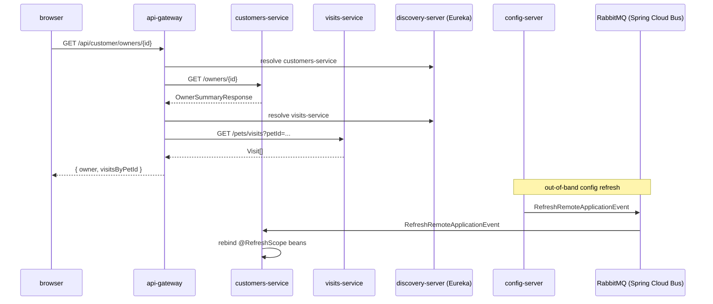

# view-owner-profile-with-visits

Browser opens an owner-details page. api-gateway aggregates customers-service (owner + pets) with visits-service (visit history) into one response.

## Flow

<pre>
1. browser → api-gateway:
   GET /api/customer/owners/{id}

2. api-gateway → customers-service · <a href="../../spring-petclinic-microservices/customers-service/flows/upsert-owner-and-pets.md">upsert-owner-and-pets</a> (read path):
   GET <a href="../../spring-petclinic-microservices/customers-service/">http://customers-service</a>/owners/{id}
   ← <a href="../../spring-petclinic-microservices/customers-service/objects/OwnerSummaryResponse.md">OwnerSummaryResponse</a> (<a href="../../spring-petclinic-microservices/customers-service/">customers-service</a> <a href="../../spring-petclinic-microservices/customers-service/contracts/rest.md">HTTP</a>)

3. api-gateway → visits-service:
   GET http://visits-service/pets/visits?petId={p1}&petId={p2}&...
   ← Visit[] (visits-service HTTP)

4. api-gateway:
   compose response { owner: <a href="../../spring-petclinic-microservices/customers-service/objects/OwnerSummaryResponse.md">OwnerSummaryResponse</a> (<a href="../../spring-petclinic-microservices/customers-service/">customers-service</a> <a href="../../spring-petclinic-microservices/customers-service/contracts/rest.md">HTTP</a>), visitsByPetId }
   return to browser

5. config-server → all services (out-of-band):
   publish RefreshRemoteApplicationEvent (Bus) on `/monitor` webhook
   customers-service · refresh-on-config-change:
     consume RefreshRemoteApplicationEvent (<a href="../../spring-petclinic-microservices/customers-service/">customers-service</a> <a href="../../spring-petclinic-microservices/customers-service/contracts/bus.md">Bus</a>)
     rebind @RefreshScope beans
</pre>

## Sequence

## Touches

### customers-service

Flows:
- [upsert-owner-and-pets](../../spring-petclinic-microservices/customers-service/flows/upsert-owner-and-pets.md) — read path (`GET /owners/{id}`)

Objects: [Owner](../../spring-petclinic-microservices/customers-service/objects/Owner.md), [Pet](../../spring-petclinic-microservices/customers-service/objects/Pet.md), [OwnerSummaryResponse](../../spring-petclinic-microservices/customers-service/objects/OwnerSummaryResponse.md)

Contracts: [REST](../../spring-petclinic-microservices/customers-service/contracts/rest.md), [MySQL](../../spring-petclinic-microservices/customers-service/contracts/mysql.md), [Eureka](../../spring-petclinic-microservices/customers-service/contracts/eureka.md), [Bus](../../spring-petclinic-microservices/customers-service/contracts/bus.md)

### External

- **browser** — HTTP client; no in-workspace docs
- **api-gateway** — Spring Cloud Gateway aggregator; resolves `customers-service` + `visits-service` via Eureka
- **visits-service** — owns `Visit` entity; called by api-gateway for visit history
- **discovery-server** — Eureka registry
- **config-server** — emits `RefreshRemoteApplicationEvent` on its `/monitor` webhook
- **RabbitMQ** — Spring Cloud Bus transport
