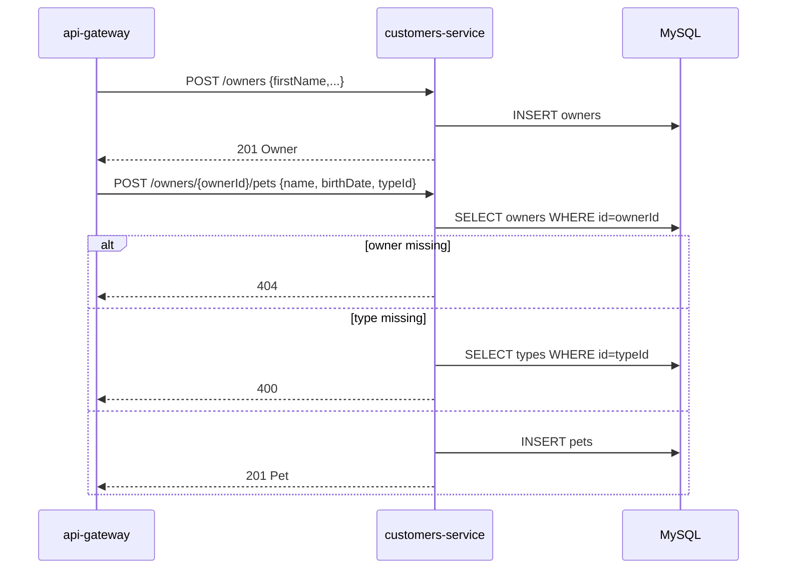

# upsert-owner-and-pets

Create or patch an owner, then attach pets to that owner. Drives every write path on customers-service.

## Trigger

Inbound HTTP from api-gateway:
- `POST /owners`, `PUT /owners/{id}`
- `POST /owners/{ownerId}/pets`, `PUT /owners/{ownerId}/pets/{petId}`

## Flow

<pre>
on POST /owners:
  validate request (Bean Validation)
  save <a href="../objects/Owner.md">Owner</a> (<a href="../contracts/mysql.md">MySQL</a>) { ...request }
  return saved <a href="../objects/Owner.md">Owner</a> (<a href="../contracts/mysql.md">MySQL</a>) (201)

on PUT /owners/{id}:
  owner ← load <a href="../objects/Owner.md">Owner</a> (<a href="../contracts/mysql.md">MySQL</a>) by id
  if owner missing: 404
  validate patch fields
  apply patch fields
  save
  return 204

on POST /owners/{ownerId}/pets:
  owner ← load <a href="../objects/Owner.md">Owner</a> (<a href="../contracts/mysql.md">MySQL</a>) by ownerId
  if owner missing: 404
  type  ← load PetType (<a href="../contracts/mysql.md">MySQL</a>) by request.typeId
  if type missing: 400
  save <a href="../objects/Pet.md">Pet</a> (<a href="../contracts/mysql.md">MySQL</a>) {
    name:       request.name,
    birth_date: request.birthDate,
    type_id:    type.id,
    owner_id:   owner.id,
  }
  return saved <a href="../objects/Pet.md">Pet</a> (<a href="../contracts/mysql.md">MySQL</a>) (201)

on PUT /owners/{ownerId}/pets/{petId}:
  pet ← load <a href="../objects/Pet.md">Pet</a> (<a href="../contracts/mysql.md">MySQL</a>) by petId
  if pet missing: 404
  apply patch fields
  save
  return 204
</pre>

## Sequence

## Touches

Storage:
- [Owner](../objects/Owner.md) (MySQL) — read + write
- [Pet](../objects/Pet.md) (MySQL) — read + write
- `PetType` (MySQL) — read (lookup table, no dedicated object doc)

Contract:
- [MySQL — owners, pets, types](../contracts/mysql.md) — read + write
- [REST — /owners/*](../contracts/rest.md) — served

## Code

- POST /owners — [OwnerResource.java](https://github.com/spring-petclinic/spring-petclinic-microservices/blob/main/spring-petclinic-customers-service/src/main/java/org/springframework/samples/petclinic/customers/web/OwnerResource.java)
- PUT /owners/{id} — [OwnerResource.java](https://github.com/spring-petclinic/spring-petclinic-microservices/blob/main/spring-petclinic-customers-service/src/main/java/org/springframework/samples/petclinic/customers/web/OwnerResource.java)
- POST /owners/{ownerId}/pets — [PetResource.java](https://github.com/spring-petclinic/spring-petclinic-microservices/blob/main/spring-petclinic-customers-service/src/main/java/org/springframework/samples/petclinic/customers/web/PetResource.java)
- PUT /owners/{ownerId}/pets/{petId} — [PetResource.java](https://github.com/spring-petclinic/spring-petclinic-microservices/blob/main/spring-petclinic-customers-service/src/main/java/org/springframework/samples/petclinic/customers/web/PetResource.java)
