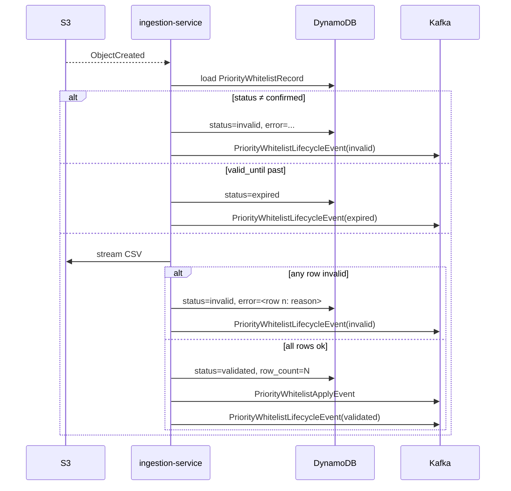

# upload-validate-emit

Validates an uploaded CSV; on success emits `PriorityWhitelistApplyEvent` so cash-blast-processor can swap on the next draw.

## Trigger

S3 `ObjectCreated:Put` on `playson-priority-whitelist-{env}/whitelists/...`, delivered through the S3 → Kafka bridge.

## Flow

<pre>
on ObjectCreated for whitelists/{date}/{id}.csv:

  record ← load <a href="../objects/PriorityWhitelistRecord.md">PriorityWhitelistRecord</a> (<a href="../contracts/dynamodb.md">DDB</a>) by id
  if record missing:
    log + drop; stop

  if record.status ≠ confirmed:
    record.status ← invalid
    record.error  ← "unexpected status: " + record.status
    emit <a href="../objects/PriorityWhitelistLifecycleEvent.md">PriorityWhitelistLifecycleEvent</a> (<a href="../contracts/kafka.md">Kafka</a>)(status=invalid)
    stop

  if record.valid_until is past:
    record.status ← expired
    emit <a href="../objects/PriorityWhitelistLifecycleEvent.md">PriorityWhitelistLifecycleEvent</a> (<a href="../contracts/kafka.md">Kafka</a>)(status=expired)
    stop

  stream + validate <a href="../objects/PriorityWhitelistCsv.md">PriorityWhitelistCsv</a> (<a href="../contracts/s3.md">S3</a>) rows from record.s3_key:
    on first row failure:
      record.status ← invalid
      record.error  ← &lt;row index + reason&gt;
      emit <a href="../objects/PriorityWhitelistLifecycleEvent.md">PriorityWhitelistLifecycleEvent</a> (<a href="../contracts/kafka.md">Kafka</a>)(status=invalid)
      stop

  record.status    ← validated
  record.row_count ← N
  emit <a href="../objects/PriorityWhitelistApplyEvent.md">PriorityWhitelistApplyEvent</a> (<a href="../contracts/kafka.md">Kafka</a>)
  emit <a href="../objects/PriorityWhitelistLifecycleEvent.md">PriorityWhitelistLifecycleEvent</a> (<a href="../contracts/kafka.md">Kafka</a>)(status=validated)
</pre>

## Sequence

## Touches

Storage:
- [PriorityWhitelistRecord](../objects/PriorityWhitelistRecord.md) (DDB) — read + write
- [PriorityWhitelistCsv](../objects/PriorityWhitelistCsv.md) (S3) — read

Stream:
- [PriorityWhitelistApplyEvent](../objects/PriorityWhitelistApplyEvent.md) (Kafka) — produced
- [PriorityWhitelistLifecycleEvent](../objects/PriorityWhitelistLifecycleEvent.md) (Kafka) — produced

Contract:
- [Kafka — apply.v1, lifecycle.v1](../contracts/kafka.md) — produced
- [DynamoDB — priority_whitelist](../contracts/dynamodb.md) — read + write
- [S3 — whitelists/{date}/{id}.csv](../contracts/s3.md) — read

## Code

- Entry — [validation.consumer.ts:22](../../../../../xplatform-priority-whitelist-ingestion-service/apps/ingestion-service/src/validation/validation.consumer.ts#L22)
- Pipeline — [validation.service.ts:18](../../../../../xplatform-priority-whitelist-ingestion-service/apps/ingestion-service/src/validation/validation.service.ts#L18)
- Emit — [emit.service.ts:42](../../../../../xplatform-priority-whitelist-ingestion-service/apps/ingestion-service/src/emit/emit.service.ts#L42)
